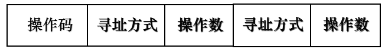

#Instruction Set Conception  
1.什么是指令？  
计算机指令是指挥机器工作的指示和命令例如：将一个数据读入寄存器，或者写入内存，或者执行加法运算等都是计算机指令。  
计算机指令是对计算机资源从一个很细粒度上进行控制，举个例子：程序是一间房子，那么指令就相当于一块砖，程序设计语  
言的一条语句可能由很多指令组成如：从语言中的加法语句Z=X+Y;它在寄存器-寄存器型的指令集中需要如下指令才能完成
                                               Load R1,X;  
                                               Load R2,Y;  
                                               ADD R3,R1,R2;  
                                               Store R3,Z;  
 注：每条指令都是直接由CPU硬件执行
 
 2.指令的表示方法以及特点  
   
 1)指令是由二进制格式表示，汇编语言是指令二进制表示的同义词（为了方便记忆指令，所以引入了汇编语言，所以汇编语言的效率几乎等同于机器语言）  
 2)指令的操作十分简单，其操作由操作码编码表示。每个操作需要的操作数个数为0-3个不等。  
 - 操作数是一些存储单元的地址；  
 - 典型的存储单元通常有：主存、寄存器、堆栈和累加器。
 
 3. 指令集的定义  
 指令集是一系列指令的集合，它存储在CPU内部，著名的指令集有x86指令集，x86指令集是Intel推出的一款经典指令集，因其在家用PC的广泛应用，所以其他CPU制造商也纷纷推出了支持x86指令集的CPU。其他著名的指令集还有ARM指令集，MIPS指令集等
 4. 指令集结构的分类  
 一般来说，可以从如下五个因素考虑对计算机指令集结构进行分类，即：  
 - 在CPU中操作数的存储方法;  
 - 指令中显式表示的操作数个数;  
 - 操作数的寻址方式;  
 - 指令集所提供的操作类型;  
 - 操作数的类型和大小;  
 
