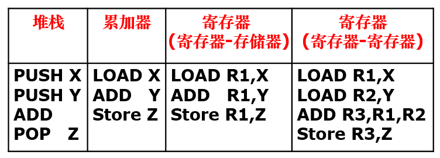
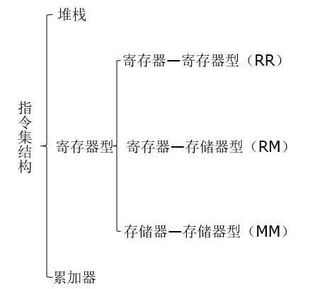
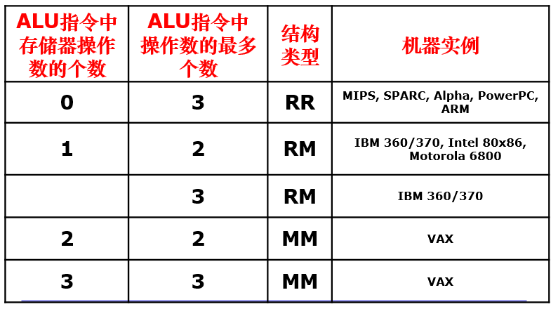
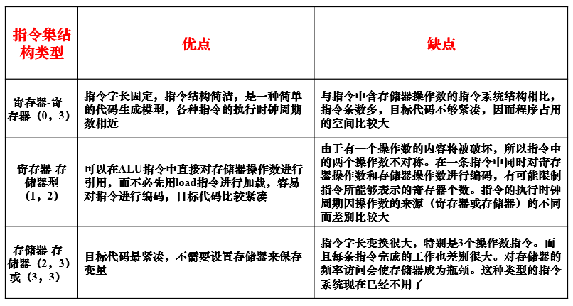
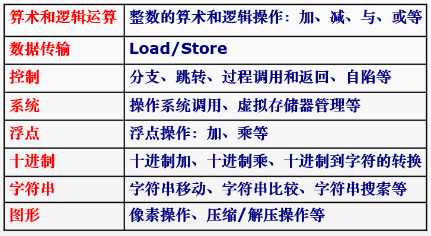

#Instruction Set Conception  
起草人：曾帅（zengsh16@lzu.edu.cn）  

1.什么是指令？ ?
计算机指令是指挥机器工作的指示和命令例如：将一个数据读入寄存器，或者写入内存，或者执行加法运算等都是计算机指令。计算机指令是对计算机资源从一个很细粒度上进行控制，举个例子：程序是一间房子，那么指令就相当于一块砖，程序设计语言的一条语句可能由很多指令组成如：从语言中的加法语句Z=X+Y;它在寄存器-寄存器型的指令集中需要如下指令才能完成  
                                               Load R1,X;  
                                               Load R2,Y;  
                                               ADD R3,R1,R2;  
                                               Store R3,Z;  
 注：每条指令都是直接由CPU硬件执行
 
 2.指令的表示方法以及特点  
   
 1)指令是由二进制格式表示，汇编语言是指令二进制表示的同义词（为了方便记忆指令，所以引入了汇编语言，所以汇编语言的效率几乎等同于机器语言）  
 2)指令的操作十分简单，其操作由操作码编码表示。每个操作需要的操作数个数为0-3个不等  
 - 操作数是一些存储单元的地址;  
 - 典型的存储单元通常有：主存、寄存器、堆栈和累加器
   
3.指令集的定义  
 指令集是一系列指令的集合，它存储在CPU内部，著名的指令集有x86指令集，x86指令集是Intel推出的一款经典指令集，因其在家用PC的广泛应用，所以其他CPU制造商也纷纷推出了支持x86指令集的CPU。其他著名的指令集还有ARM指令集，MIPS指令集等
  
4.指令集结构的分类:一般来说，可以从如下五个因素考虑对计算机指令集结构进行分类，即：
 - 在CPU中操作数的存储方法; ?
 - 指令中显式表示的操作数个数;  
 - 操作数的寻址方式;  
 - 指令集所提供的操作类型;  
 - 操作数的类型和大小;  
 我们一般关注CPU操作数的存储方式：如Z=X+Y表达式在这三种类型指令集结构上的实现方法
 
   
 
 在这三种类型的指令集机构中我们一般又最关心寄存器型指令结构而寄存器机构又可以进一步划分为
 - 寄存器——寄存器型（R——R：register-register）
 - 寄存器——存储器型（R——M：register-memory）
 - 存储器——存储器型（M——M：memory-memory）
 
 
 
 5.通用寄存器型指令集结构的分类  
 1）通用寄存器型指令集结构的主要优点:
    - 在表达式求值方面，比其它类型指令集结构都具有更大的灵活性；
    - 寄存器可以用来存放变量；
      - 减少存储器的通信量，加快程序的执行速度（因为寄存器比存储器快）
      - 可以用更少的地址位来寻址寄存器，从而可以有效改进程序的目标代码大小。  
2）通用寄存器型指令集的分类  
	两种主要的指令特性能够将通用寄存器型指令集结构（GPR）进一步细分。
	- ALU指令到底有两个或是三个操作数？
	- 在ALU指令中，有多少个操作数可以用存储器来寻址，也即有多少个存储器操作数？
 	
3）三种通用寄存器型指令集结构的优缺点
	  
  
  6.指令集操作的分类  
    
  
  以控制指令为例子：控制指令可以分为以下四种情况
  - 条件分支（conditional branch）：而当控制指令是有条件改变控制流时，我们称之为“分支”
  - 跳转（jump）：当控制指令为无条件改变控制流时，我们称之为“跳转”
  - 过程调用（call）
  - 过程返回（return）  
  
  7.CISC VS RISC
  1）CISC：复杂指令集计算机 ，CISC 计算机的指令系统比较丰富，有专用指令来完成特定的功能，实现软件功能向硬件功能转移。因此，处理特殊任务效率较高  
  2）RISC：设计者把主要精力放在那些经常使用的指令上，尽量使它们具有简单高效的特色。对不常用的功能，常通过组合指令来完成  
  注：也就CISC所有功能，RISC都可以通过指令组合的方式来进行实现。RISC指令的功能粒度更小。自Intel奔腾四以后，intel处理器虽然还是支持CISC（x86指令集）但是其底层会将复杂指令指令转化为简单指令的组合  
  3）比较：  
  - RISC 汇编语言程序一般需要较大的内存空间，实现特殊功能时程序复杂，不易设计；而CISC 汇编语言程序编程相对简单，科学计算及复杂操作的程序设计相对容易，效率较高
  - RISC CPU 包含有较少的单元电路，因而面积小、功耗低；而CISC CPU 包含有丰富的电路单元，因而功能强、面积大、功耗大（CISC机器中硬件要实现更加复杂的功能所以需要更多的原件相互配合）  
  - 由于RISC 指令系统的确定与特定的应用领域有关，故RISC 机器更适合于专用机；而CISC 机器则更适合于通用机  
  - RISC 机器在一条指令执行的适当地方可以响应中断；而CISC 机器是在一条指令执行结束后响应中断  
  
  注：在CISC结构的指令系统中，由于各条指令的功能不均衡性，不利于采用先进的计算机体系结构技术（如流水技术）来提高系统的性能，且CISC设计越来越复杂，因此RISC会逐渐成为主流
